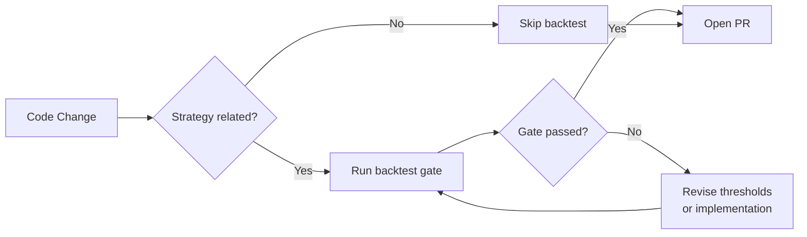
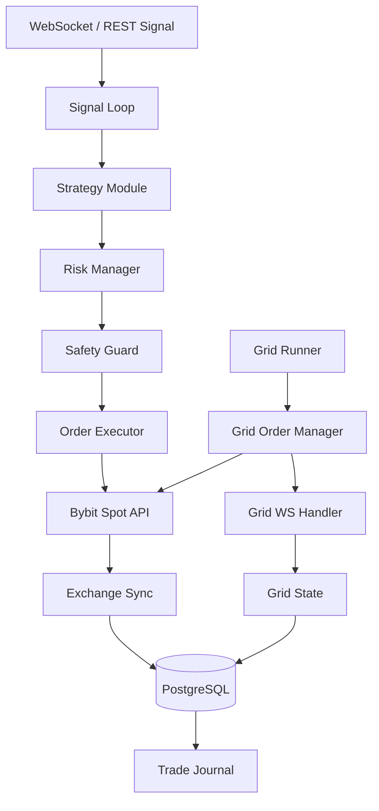

<p align="center">
  
</p>

<p align="center">
  <a href="https://github.com/AmaLS367/AmaExecutionCore/issues">
    
  </a>
  <a href="https://github.com/AmaLS367/AmaExecutionCore/pulls">
    
  </a>
  
  
</p>

---

Thank you for your interest in contributing to **AmaExecutionCore**! This document explains how to set up your development environment and the standards we follow.

> **Important**: This project interacts with real financial APIs. All changes must pass the full CI pipeline — including backtests — before merging.

---

## Table of Contents

- [Development Setup](#development-setup)
- [Branching Strategy](#branching-strategy)
- [Code Standards](#code-standards)
- [Testing Requirements](#testing-requirements)
- [Backtest Gate](#backtest-gate)
- [Pull Request Process](#pull-request-process)
- [Architecture Overview](#architecture-overview)

---

## Development Setup

<details>
<summary><strong>Prerequisites</strong></summary>

- Python 3.11+
- [uv](https://github.com/astral-sh/uv) package manager
- Docker + Docker Compose (for integration tests)
- A Bybit testnet account (for E2E tests)

</details>

<details>
<summary><strong>Step-by-step</strong></summary>

```bash
# 1. Clone the repository
git clone https://github.com/AmaLS367/AmaExecutionCore.git
cd AmaExecutionCore

# 2. Install all dependencies (including dev extras)
uv sync --extra dev

# 3. Copy and configure environment
cp .env.example .env
# Edit .env — set DATABASE_URL and BYBIT_TESTNET_API_KEY if needed

# 4. Run database migrations
uv run alembic upgrade head

# 5. Start the application
uv run uvicorn backend.main:app --reload
```

</details>

<details>
<summary><strong>Running the quality pipeline locally</strong></summary>

Run all checks in the same order as CI:

```bash
# Lint + format
uv run ruff check .
uv run ruff format --check .

# Type checking
uv run mypy backend tests

# Unit + integration tests
uv run pytest -q -rs

# Backtest smoke gate (must pass before any PR)
uv run python scripts/backtest_gate.py \
  --manifest scripts/fixtures/backtest_manifest.json \
  --mode regression \
  --suite smoke \
  --output artifacts/backtest-smoke.json
```

</details>

---

## Branching Strategy

```
main       ← production (protected, deploy-on-push)
  └── dev  ← integration branch (all PRs target here)
        └── feat/your-feature
        └── fix/your-fix
```

- **Never push directly to `main` or `dev`.**
- Branch from `dev`, open a PR into `dev`.
- `dev` is periodically merged into `main` to trigger production deployment.

---

## Code Standards

| Tool | Purpose | Config |
|------|---------|--------|
| `ruff` | Linting + formatting | `pyproject.toml` |
| `mypy` | Static type checking | `pyproject.toml` |
| `pytest` | Testing | `pyproject.toml` |

Key rules:

- **No `Any` types** — use explicit types everywhere.
- **No `# noqa` suppression** without a comment explaining why.
- **No print statements** — use `logging` or `structlog`.
- Strategy modules **never** call order placement directly. Only `order_executor` places orders.
- All new config values go through `backend/config.py` `Settings` with a `field_validator`.

---

## Testing Requirements

Every PR must include or update tests for changed behaviour:

- **Unit tests** in `tests/` — no live API calls, mock exchange responses.
- **Integration tests** may use `TEST_POSTGRESQL_URL` (provided in CI).
- Test files mirror the module structure: `backend/grid_engine/foo.py` → `tests/grid_engine/test_foo.py`.

Minimum bar:

```bash
uv run pytest -q -rs  # must pass with 0 errors
```

---

## Backtest Gate

Strategy or grid engine changes **must** pass the backtest gate:



Profiles are defined in `scripts/fixtures/backtest_manifest.json`. Do not lower thresholds to make a failing strategy pass — fix the strategy.

---

## Pull Request Process

1. Ensure the **full local pipeline** passes (see [Running the quality pipeline locally](#running-the-quality-pipeline-locally)).
2. Open a PR from your branch into `dev`.
3. Fill out the PR template with a summary and test plan.
4. Wait for CI: `pytest`, `backtest` (smoke), `quality` jobs must all be green.
5. One approving review is required before merge.

---

## Architecture Overview



---

<p align="center">
  Made with care for responsible trading.<br/>
  Questions? Open an issue or reach out on <a href="https://t.me/Amanel0">Telegram</a>.
</p>

<p align="center">
  
</p>
