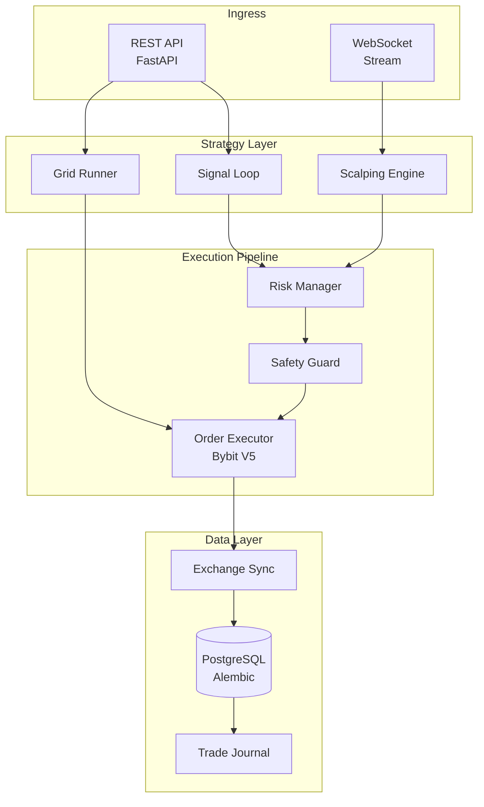
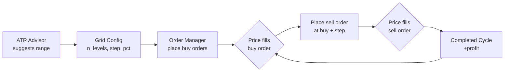
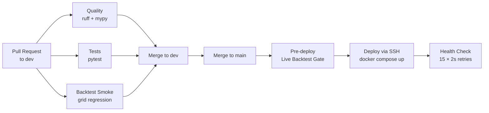

<p align="center">
  
</p>

<p align="center">
  <a href="https://github.com/AmaLS367/AmaExecutionCore/actions/workflows/tests.yml">
    
  </a>
  <a href="https://github.com/AmaLS367/AmaExecutionCore/actions/workflows/quality.yml">
    
  </a>
  <a href="https://github.com/AmaLS367/AmaExecutionCore/actions/workflows/deploy.yml">
    
  </a>
</p>

<p align="center">
  
  
  
  
  
  
</p>

<p align="center">
  <a href="https://img.shields.io/badge/License-MIT-green">
    
  </a>
  
  <a href="https://github.com/sponsors/AmaLS367">
    
  </a>
</p>

<p align="center">
  
</p>

---

## Overview

**AmaExecutionCore** is a production-grade algorithmic trading system for **Bybit Spot**, built with capital protection as the primary objective. It follows a strict scaling philosophy:

> **Shadow** (paper trading) → **Demo** (Bybit testnet) → **Tiny Real** (live, minimal size) → **Controlled Scale**

The system never risks more than it should. Every order goes through risk validation, safety guard checks, and idempotency guarantees before touching the exchange.

---

## Features

| Feature | Description | Status |
|---------|-------------|--------|
| **Grid Trading Engine** | ATR-advised arithmetic grids with automated buy/sell order management | ✅ Live |
| **Risk Manager** | Exact lot sizing, minimum RRR enforcement, exposure limits | ✅ Live |
| **Safety Guard** | Daily/weekly loss circuit breakers, consecutive-loss kill switch | ✅ Live |
| **Signal Loop** | Periodic strategy evaluation with configurable symbols and intervals | ✅ Live |
| **Scalping Engine** | WebSocket-driven real-time scalping strategies | ✅ Live |
| **Trade State Machine** | Full lifecycle tracking: PENDING → OPEN → CLOSED | ✅ Live |
| **Idempotency** | Request deduplication via deterministic `orderLinkId` fingerprinting | ✅ Live |
| **Backtest Gate** | Manifest-driven CI gate with walk-forward validation | ✅ Live |
| **Shadow Runner** | Local pipeline validation without any real capital | ✅ Live |
| **Demo Runner** | End-to-end Bybit testnet validation | ✅ Live |

---

## Architecture



---

## Grid Trading Engine

The Grid Engine is the primary active strategy. It places a ladder of buy/sell limit orders across an arithmetic price range and profits from oscillation — **no directional prediction needed**.



**Gate thresholds (regression suite):**

| Metric | Threshold |
|--------|-----------|
| Min completed cycles | ≥ 20 |
| Min annualized yield | ≥ 10% |
| Min fee coverage ratio | ≥ 2.0× |
| Max unrealized drawdown | ≤ 55% |
| Min profitable windows | ≥ 50% |

---

## Quick Start

### Prerequisites

- Python 3.11+, [uv](https://github.com/astral-sh/uv), Docker, Docker Compose

### Local development

```bash
# Install dependencies
uv sync --extra dev

# Configure environment
cp .env.example .env
# Set DATABASE_URL, BYBIT_TESTNET_API_KEY, etc.

# Run migrations
uv run alembic upgrade head

# Start the server
uv run uvicorn backend.main:app --reload
```

### Shadow mode (no real capital)

```bash
# Execute a shadow signal
curl -X POST http://127.0.0.1:8000/signals/execute \
  -H "Content-Type: application/json" \
  -d '{"symbol":"XRPUSDT","direction":"long","entry":0.50,"stop":0.46,"target":0.60}'

# Suggest a grid configuration
curl -X POST http://127.0.0.1:8000/grid/suggest \
  -H "Content-Type: application/json" \
  -d '{"symbol":"XRPUSDT","interval":"15","lookback_bars":96}'
```

### Docker (production)

```bash
# Build and start all services
docker compose up -d --build

# Check health
curl http://127.0.0.1:8000/health

# View bot logs
docker logs ama_bot --tail 50 -f
```

---

## Configuration

Key environment variables (see `.env.example` for the full list):

| Variable | Default | Description |
|----------|---------|-------------|
| `TRADING_MODE` | `shadow` | `shadow` / `demo` / `live` |
| `BYBIT_TESTNET` | `true` | Use testnet credentials |
| `DATABASE_URL` | — | PostgreSQL or SQLite connection string |
| `RISK_PER_TRADE_PCT` | `0.01` | Max risk per trade (1%) |
| `MAX_DAILY_LOSS_PCT` | `0.03` | Daily loss circuit breaker (3%) |
| `SIGNAL_LOOP_ENABLED` | `false` | Enable periodic signal loop |
| `SCALPING_ENABLED` | `false` | Enable scalping engine |

---

## CI / CD Pipeline



All merges to `main` trigger a live backtest gate before deployment. A failed gate blocks the deploy.

---

## Project Structure

```
AmaExecutionCore/
├── backend/
│   ├── api/              # FastAPI routers
│   ├── grid_engine/      # Grid Trading Engine
│   ├── strategy_engine/  # Strategy implementations
│   ├── risk_manager/     # Position sizing, RRR checks
│   ├── safety_guard/     # Circuit breakers, kill switch
│   ├── order_executor/   # Bybit V5 order placement
│   ├── exchange_sync/    # Order status reconciliation
│   └── config.py         # Pydantic settings
├── scripts/
│   ├── backtest_gate.py  # CI gate runner
│   └── fixtures/         # Manifests + regression data
├── tests/                # pytest suite
├── alembic/              # Database migrations
└── .github/
    └── workflows/        # CI/CD pipelines
```

---

## Contributing

See [CONTRIBUTING.md](CONTRIBUTING.md) for development setup, code standards, and the PR process.

---

## Security

To report a vulnerability, **do not open a public issue**. See [SECURITY.md](SECURITY.md) for responsible disclosure instructions.

---

## License

Apache 2.0 © [AmaLS367](https://github.com/AmaLS367)

<p align="center">
  
</p>
